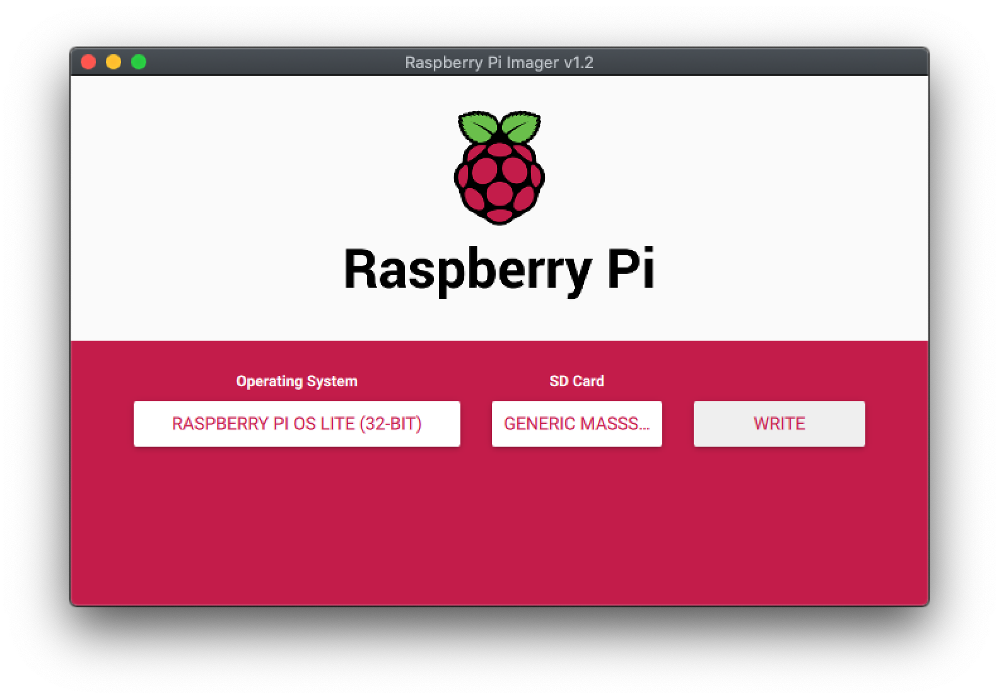

# Raspberry Pi Tutorial: Setting up a Headless Raspberry Pi

Download the Raspberry Pi Imager at:
<https://www.raspberrypi.org/downloads/>

Install the software and plug the SD card into your computer.

Select the `Raspberry Pi OS (other)` and then `Raspberry Pi OS Lite` (without
all the extra software)


Select the SD card in the Raspberry Pi Imager software, and then click `write`
when you are ready!



Make a file on the SD card named `ssh` (with no extension). This will allow you
to connect to your Raspberry Pi remotely once you have flashed the operating
system.


This can be done (on a Mac) in a terminal like so:

```bash
touch /Volumes/boot/ssh
```

Next, add your add your wifi network authentication details in a file named
`wpa_supplicant.conf` (this may be different if your network is not secured with
WPA, but it should be...)

```bash
nano /Volumes/boot/wpa_supplicant.conf
```

Add these lines to the file:

```conf
country=US
ctrl_interface=DIR=/var/run/wpa_supplicant GROUP=netdev
update_config=1

network={
    ssid="NETWORK-NAME"
    psk="NETWORK-PASSWORD"
}
```

Eject the SD card from your computer, insert into Raspberry Pi, and power on.

Next, connect over SSH. Open a terminal and type:

```bash
ssh-keygen -R raspberrypi.local
ssh pi@raspberrypi.local
password: raspberry
```

Then, change the hostname (default: raspberrypi) and password (default:
raspberry) with:

```bash
sudo raspi-config
```
