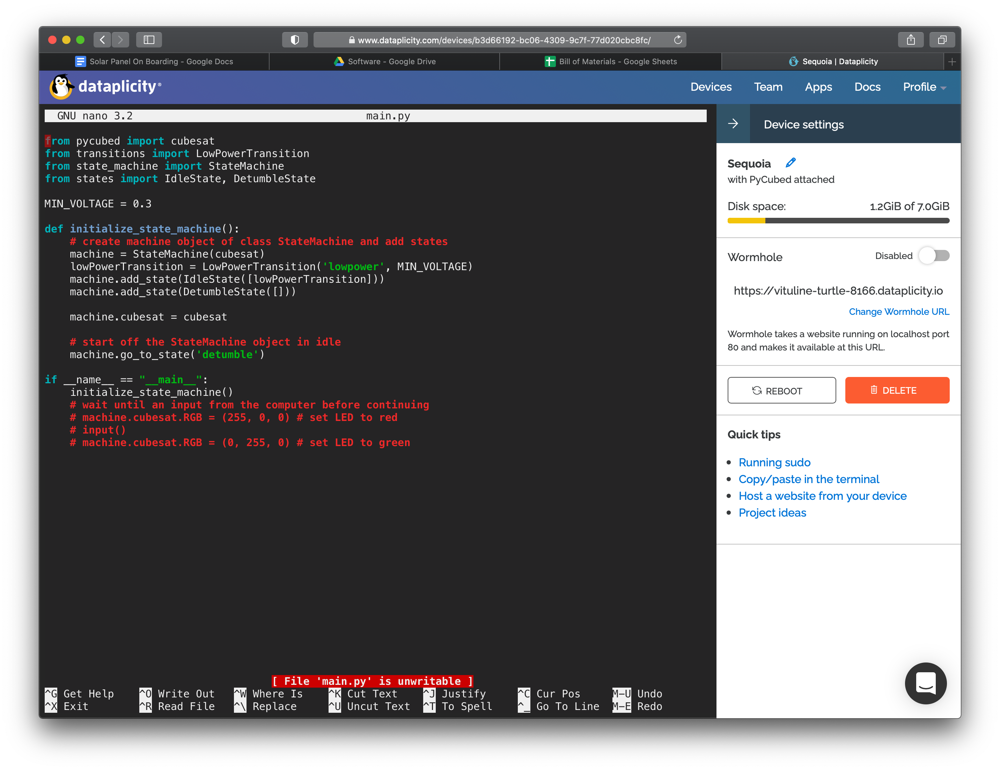
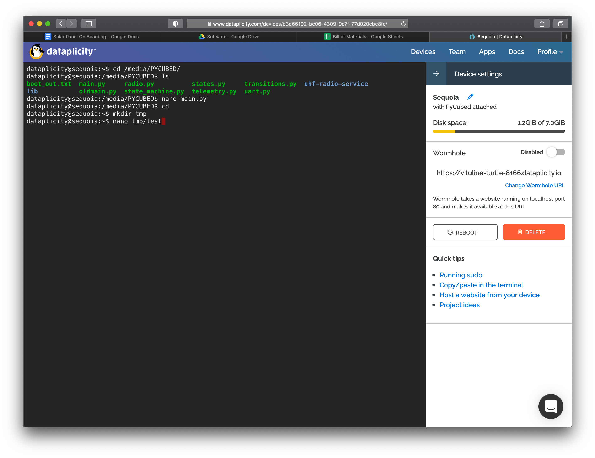

# Dataplicity Tutorial 1: Getting Access, Online Interface, and Unix Tools

We use Dataplicity to remotely manage Raspberry Pi's and access to flight hardware such as PyCubed. First, ask Langston, Moritz, or Flynn for access to Dataplicity.

https://www.dataplicity.com

Head over to the `devices` page:

<p align="center">
  <br>
  <br><br>
</p>

Select the `Sequoia` Raspberry Pi:

<p align="center">
  <br>
  <br><br>
</p>

The PyCubed drive is mounted at `/media/PYCUBED`. In the web view here, there are a number of software tools available to you, such as the ability to reboot, in the right column. All of the unix tools installed on the Raspberry Pi are somewhat accessble to you-- you can use the `nano` text editor but you can't scp from your computer to the Raspberry Pi in this interface.

## nano example
Let's edit a file on the PyCubed drive with `nano`!
```
nano main.py
```

<p align="center">
  <br>
  <br><br>
</p>

`Enter` to edit the file.

<p align="center">
  <br>
  <br><br>
</p>

Oops, we aren't allowed to edit the file! That is because the file is in use by Circuit Python on the drive. Instead, we will edit a file on the Raspberry Pi and then copy it over!

<p align="center">
  <br>
  <br><br>
</p>
and then save with `ctrl-s` ("save") or `ctrl-o` ("write out", for this option you will be prompted for a name). Then `ctrl-x` to exit.

<p align="center">
  <br>
  <br><br>
</p>

We can make sure we saved the file with the `cat` command (which is technically for concatenating, or combining files, but works fine for this!)

<p align="center">
  <br>
  <br><br>
</p>

Now, we will move the file to the PyCubed with the `cp` ("copy") command:

<p align="center">
  <br>
  <br><br>
</p>

Oops, permission denied. You need administrator privileges to write files to the 

Despite all of these cool things, _we don't recommend using the web interface_ because it crashes fairly often.


---------------------------------------

## Next Steps

Checkout the [next tutorial](tutorial_dataplicity_2.md) to learn how to access Dataplicity enabled Raspbery Pi's with Porthole in your desired terminal—-on your computer, _not_ in a browser!